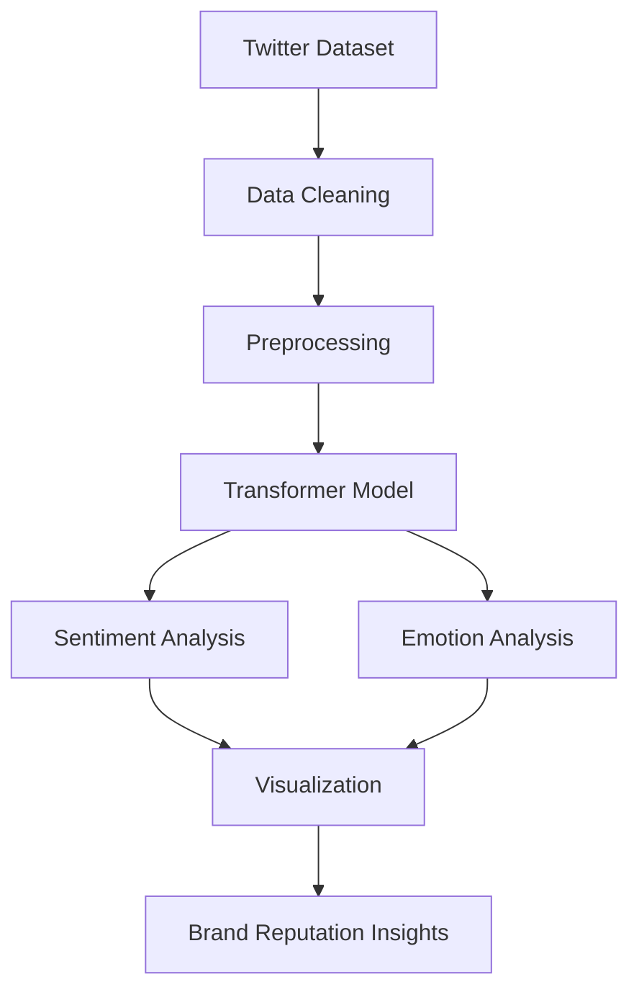

# 🧠 Brand Reputation Analysis using Transformer-Based NLP


---

## 📖 Overview

This repository presents an AI-driven framework for **brand reputation analysis** using Natural Language Processing (NLP) techniques applied to large-scale Twitter data. The project investigates how sentiment and emotional trends extracted from social media can be leveraged to understand public perception of brands and generate actionable business insights.

Developed during a research internship, the project demonstrates the practical application of Transformer-based language models, sentiment analysis, emotion detection, and interactive data visualization to support data-driven brand reputation assessment.

---

## 🎯 Research Motivation

Modern organizations continuously receive thousands of customer opinions through social media platforms. Manually analyzing this information is impractical, making automated sentiment and emotion analysis an important tool for understanding customer perception.

This project explores how Natural Language Processing can transform unstructured textual data into meaningful insights that support brand monitoring, customer satisfaction analysis, and strategic decision-making.

---

## 🎯 Research Objectives

- Analyze public opinion using large-scale Twitter data.
- Detect positive, neutral, and negative sentiment.
- Identify emotional patterns within customer opinions.
- Visualize brand perception trends.
- Demonstrate the application of Transformer-based NLP models for social media analytics.

---

## 🏗 Methodology

The analytical workflow consists of the following stages:

1. Data Collection
2. Data Cleaning and Preprocessing
3. Text Normalization
4. Sentiment Analysis
5. Emotion Analysis
6. Data Aggregation
7. Interactive Visualization
8. Brand Reputation Assessment

---

## 🔄 Research Workflow



---

## 📂 Dataset

The experiments use the **Twitter Sentiment Dataset (3 Million Labelled Rows)** publicly available on Kaggle.

Dataset Source:

[Twitter Sentiment Dataset (3 Million Labelled Rows)](https://www.kaggle.com/datasets/prkhrawsthi/twitter-sentiment-dataset-3-million-labelled-rows)

The dataset is not included in this repository due to its size and to respect the original distribution source.

---

## 🛠 Technology Stack

| Category | Technologies |
|-----------|--------------|
| Programming Language | Python |
| Notebook Environment | Jupyter Notebook |
| Data Processing | Pandas, NumPy |
| Machine Learning | Transformers, PyTorch |
| Natural Language Processing | Hugging Face Transformers |
| Visualization | Matplotlib, Plotly |

---

## 📁 Repository Structure

```text
Brand-Reputation-Analysis/

├── dataset/
│   └── README.md

├── notebooks/
│   └── Brand_Reputation_Analysis.ipynb

├── outputs/
│   ├── visualization_data.json
│   └── brand_reputation_results.pkl

├── README.md
├── requirements.txt
├── LICENSE
└── .gitignore
```
---

## 📊 Research Highlights

- Applied Transformer-based NLP techniques to large-scale Twitter data.
- Investigated sentiment and emotion trends for brand reputation assessment.
- Developed a complete data analysis pipeline from preprocessing to visualization.
- Produced interpretable insights to support brand perception analysis.

---

## 🔮 Future Work

- Extend the framework to support multilingual sentiment analysis.
- Compare multiple Transformer architectures.
- Integrate real-time social media data collection.
- Develop an interactive dashboard for live reputation monitoring.
- Explore multimodal analysis by incorporating images and videos.

---

## 🙏 Acknowledgements

This project was developed during a research internship focused on Natural Language Processing and Brand Reputation Analysis. The work demonstrates the practical application of AI techniques for analyzing social media content and extracting meaningful insights from unstructured textual data.

---

## 📖 Citation

If you use this repository for academic or research purposes, please cite it appropriately or reference this repository.

```bibtex
@misc{brand_reputation_analysis,
  title={Brand Reputation Analysis using Transformer-Based NLP},
  author={Vidhya Harini Vijayarajan Sangeetha},
  year={2026},
  note={Research Internship Project},
  url={https://github.com/vidhyaharini0/Brand-Reputation-Analysis}
}
